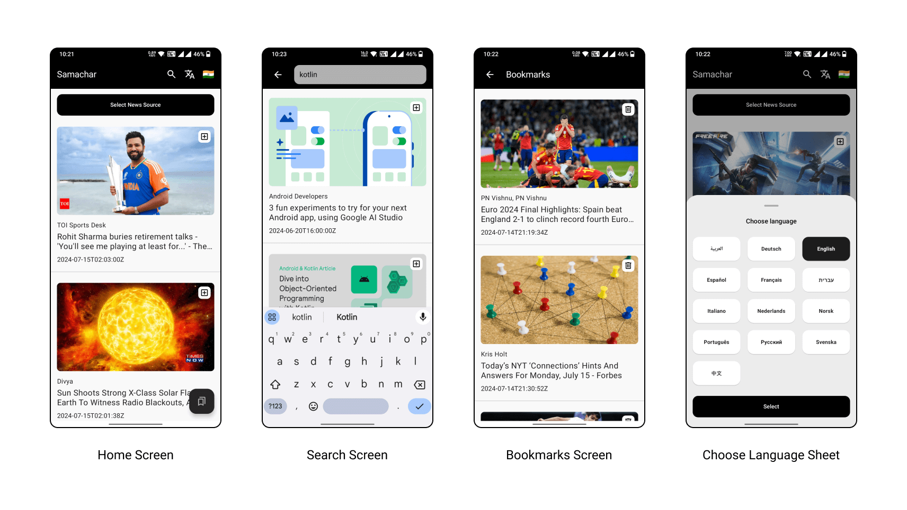

<h1 align="center">Samachar</h1>

  
🎨 Samachar is an Android news app built to demonstrate the MVVM architecture in Kotlin. It utilizes Jetpack Compose, Dagger Hilt, Retrofit, RoomDB, Coroutines, and Flow. ✨

## App UI

   

